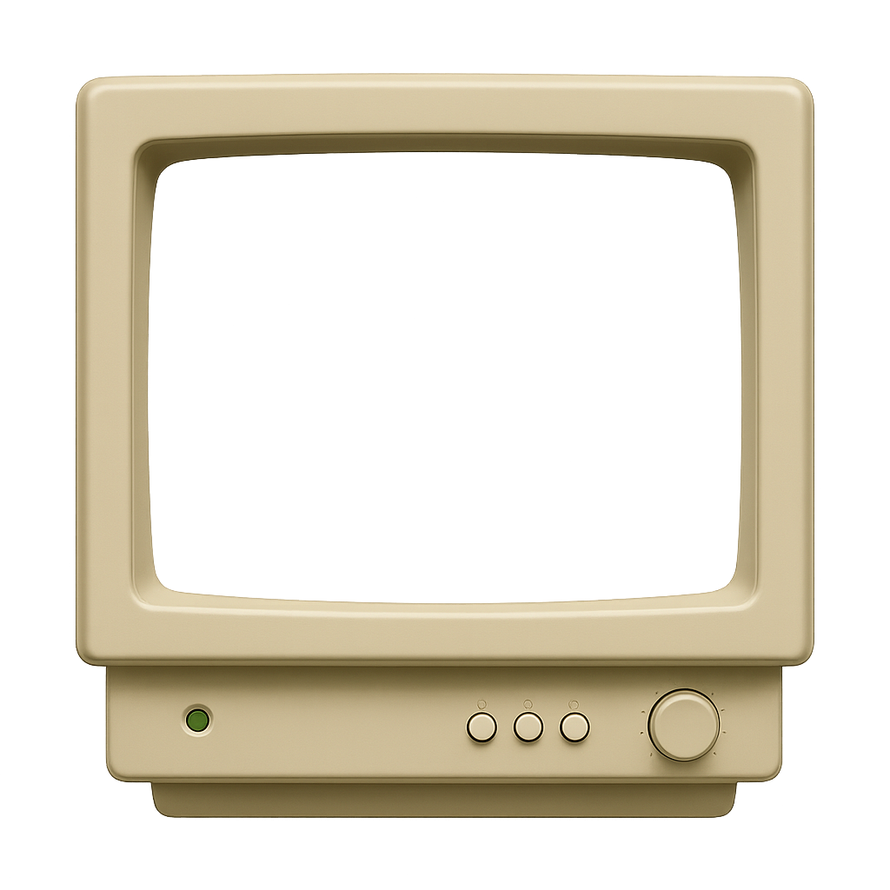

<div align="center">

# 🖥️ Retro Mac Portfolio

Un portfolio retro con ventanas, terminal y efecto CRT, hecho con React + TypeScript + Vite. Funciona en escritorio y móvil. ✨



</div>

## 🚀 Características

- Ventanas arrastrables con barra de título, tamaño y capas (z-index)
- Modo móvil con iconos grandes y ventanas a pantalla completa
- Temas: Classic (gris), Green Phosphor 🟢 y Amber 🟠 con tipografía legible
- Terminal retro integrada (accesos a proyectos y redes)
- Efecto de pantalla curva (CRT) con capas y superposiciones
- Bloqueo de pantalla y “screensaver” opcional

## 🧰 Requisitos

- Node 18+ y pnpm (o npm/yarn)

## ▶️ Cómo ejecutar

```bash
pnpm install
pnpm dev
```

Build de producción:

```bash
pnpm run build
pnpm run preview
```

## 🧑‍🎨 Personalización rápida (datos personales)

Todo lo configurable está centralizado en: `src/config/personalize.ts`.

Ahí puedes cambiar:
- `BRAND`: tu nombre o marca (aparece en la barra superior y títulos)
- `PROJECTS`: proyectos con `title`, `short`, `tech`, `url` e `image`
- `SOCIAL_LINKS`: tus redes (solo las que rellenes se mostrarán)
- `CONTACT`: email, WhatsApp y enlace externo
- `ABOUT`: textos del About, etiquetas de memoria, imagen de “PC”, `skills` (iconos)
 - `ICONS`: rutas de iconos centralizadas
	 - `desktop`: Projects/Social/About/Terminal y opcional `settings`
	 - `folders`: iconos PNG de carpeta `open`/`close` usados en Projects (desktop y móvil)
	 - `quick` (opcional): iconos para los botones rápidos del pie en móvil (`email`, `about`, `whatsapp`, `external`)

Notas útiles:
- Si una imagen es local (por ejemplo `icons/...`), el sistema la “prefija” con el `base` correcto para GitHub Pages, no necesitas preocuparte por rutas absolutas.
- Si apuntas a una URL externa (`https://...`), se usa tal cual.

También puedes sobreescribir el About directamente en el componente `src/components/AboutBody.tsx`, pero la forma recomendada es usar el objeto `ABOUT` del archivo de configuración anterior.

Más detalles y consejos: lee `CUSTOMIZE.md` 📘

## 🎨 Temas y accesibilidad del cursor

- Temas disponibles: `classic`, `phosphor`, `amber`.
- El cursor cambia a una versión de alto contraste en temas oscuros para que se vea siempre bien.
- El tema seleccionado queda guardado en `localStorage`.

## ⌨️ Atajos y extras

- Alt + C: panel de depuración de curvatura CRT
- Alt + R: reiniciar “sistema” (animación de arranque)
- Alt + L: bloquear pantalla
- Desbloqueo: escribe los 4 primeros dígitos de un número muy famoso ➜ `3141`

## 📁 Estructura útil

- `src/RetroMac128KPortfolio.tsx`: vista “escritorio” (modo principal en PC)
- `src/MobileHome.tsx`: vista optimizada para móvil
- `src/components/Window.tsx`: ventana genérica (contenedor con scroll automático cuando hace falta)
- `src/components/RetroTerminal.tsx`: terminal retro
- `src/components/AboutBody.tsx`: contenido de la ventana About
- `src/config/personalize.ts`: TU fichero de datos personales 💾

## 🌐 Despliegue (GitHub Pages)

Este proyecto funciona bien en GitHub Pages (tanto en usuario como en “project site”).
- Detecta automáticamente el `base` a partir de `<base href>` o del primer segmento de la URL.
- Por eso las imágenes locales se resuelven correctamente incluso bajo `/tu-repo/`.

## 🧪 Estado del proyecto

- Construcción verificada con `pnpm run build` ✅
- TypeScript sin errores ✅

## 📜 Licencia

Uso personal y educativo. Revisa los assets/recursos que añadas (iconos e imágenes) para respetar sus licencias.

---

¿Sugerencias o mejoras? Abre un issue o propón un PR. ¡Que disfrutes trasteando! 😄
